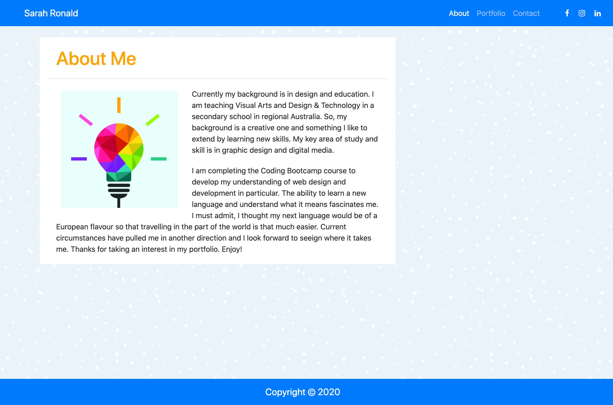
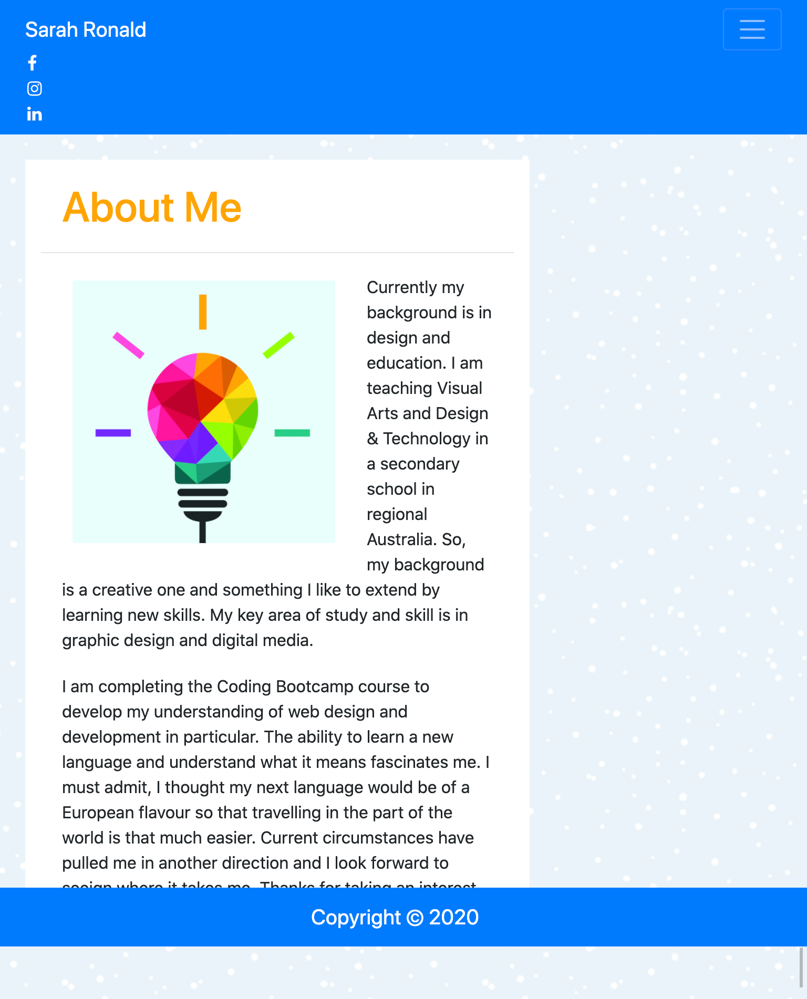
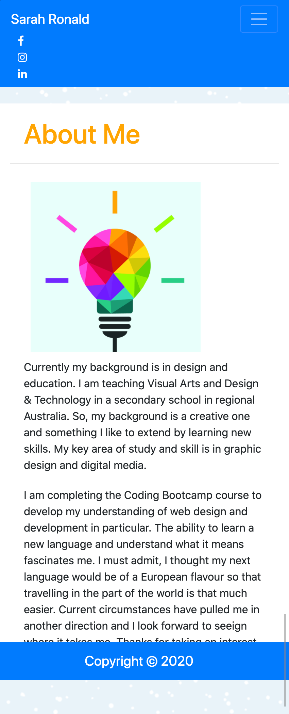
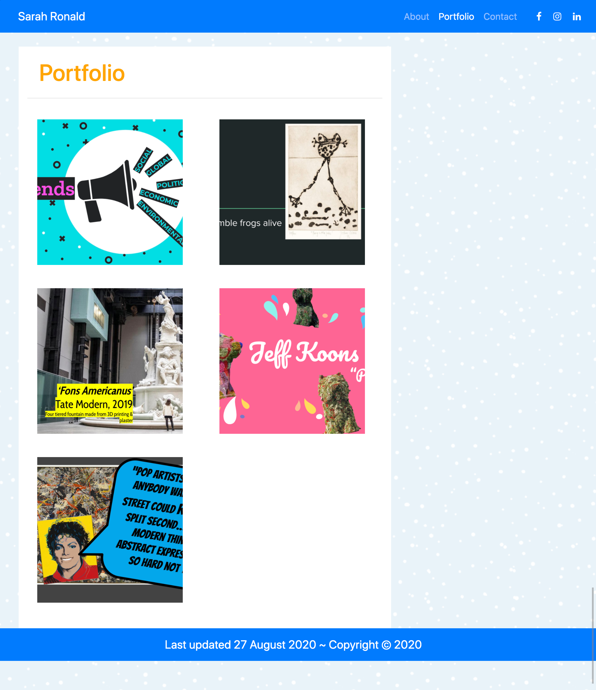
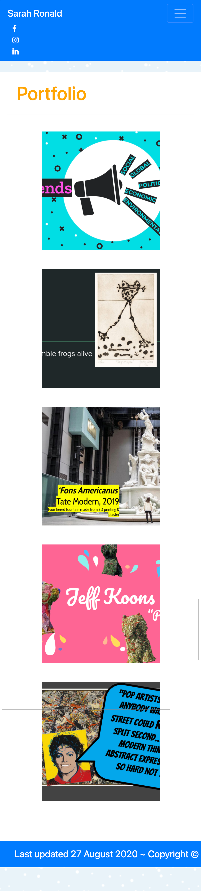
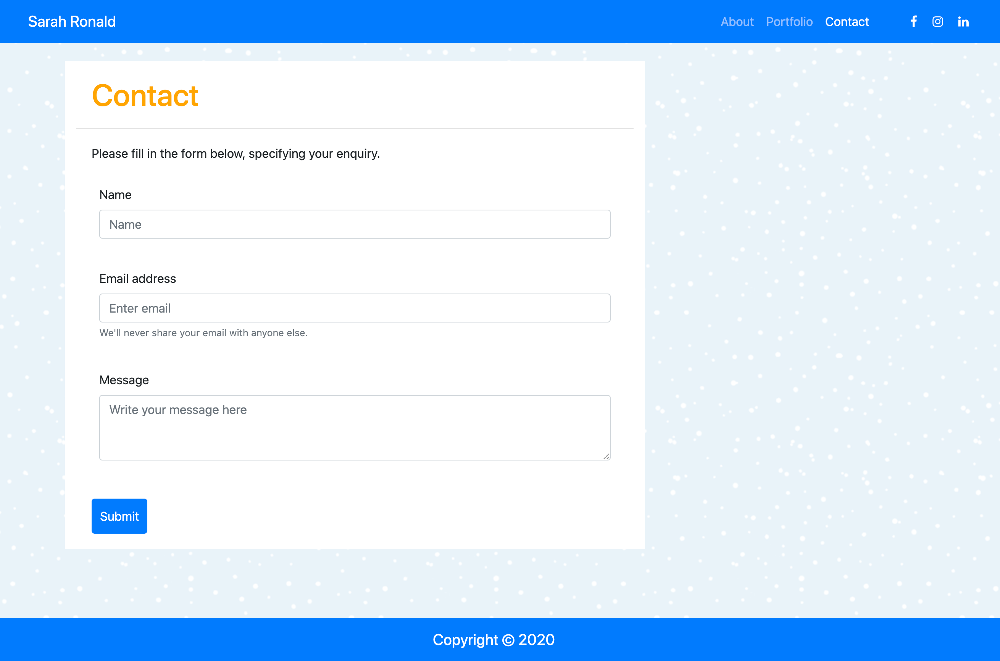
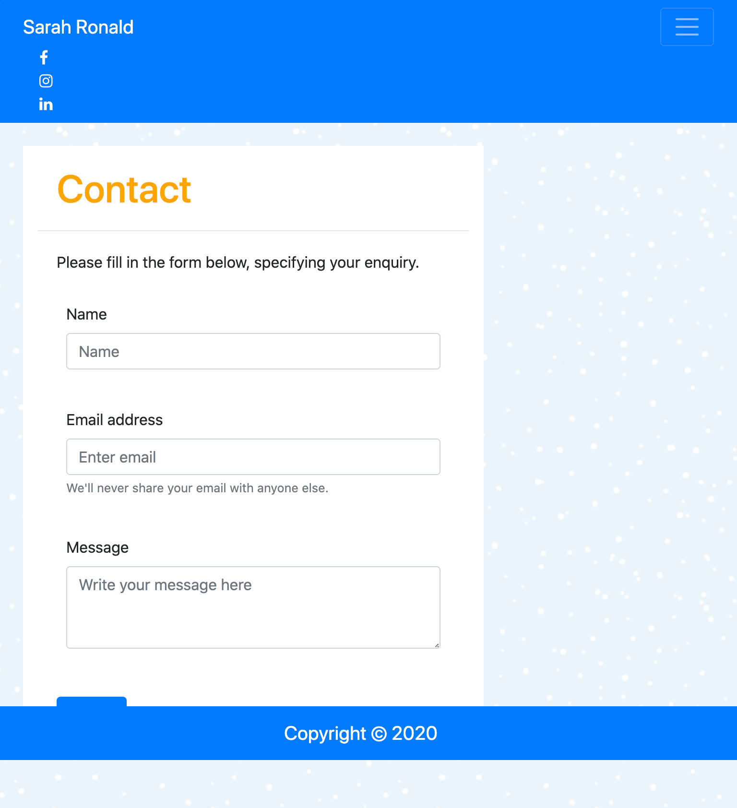

# 02-hw-responsive-portfolio
// Homework Task 02 CSS and Bootstrap Homework: Responsive Portfolio //

## Contents

 
This responsive webpage is composed of 4 pages: index.html, portfolio.html, contact.html and style.css. The folder also includes an /assets folder that contains any images used in the website.

## User Story

Responsive design ensures that web applications render well on a variety of devices and windows or screen sizes. As a developer, this projects represents a basic digital portfolio about me and my work, including a contact page for others to fill in a form.

## Built With
* [Terminal]
* [VScode](https://code.visualstudio.com/) - The editor of choice
* [Bootstrap](https://getbootstrap.com/docs/4.5/components/alerts/)
* [Font Awesome](https://getbootstrap.com/docs/4.5/components/alerts/)
* [W3 HTML validator](https://validator.w3.org/)

#### Initial interface

Format: 

Format: 

Format: 

Format: 

Format: 

Format: 

Format: 

### Licence
* [Font Awesome License](https://getbootstrap.com/docs/4.5/components/alerts/) Last updated July 12, 2018

### Link to the App

Link to the App: "file:///Users/sarahronald/usyd-syd-fsf-pt-08-2020-u-c/coding-bootcamp-homework/02-hw-responsive-portfolio/index.html"
 <a href="file:///Users/sarahronald/usyd-syd-fsf-pt-08-2020-u-c/coding-bootcamp-homework/02-hw-responsive-portfolio/index.html">Link to the App</a>

## Authors
* **SARAH RONALD** - 
Contact information:
sareronald@hotmail.com
